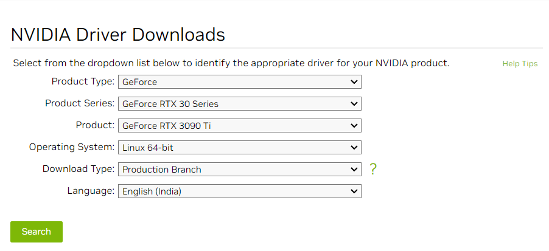

# Install NVIDIA Driver/Cuda toolkit/cudnn เครื่อง 28 สำหรับ NVIDIA GeForce RTX 3090Ti และ NVIDIA GeForce RTX 2080Ti

- [X] OS detail
  - Ubuntu 20.04/Linux x86_64

- [X] Graphic card detail (เดิม)

```
nvidia-smi -l

"NVIDIA-SMI 515.65.01
Driver Version: 515.65.01
CUDA Version: 11.7"
```

- [X] Finding out information about GPU

```
sudo lshw -C display
```

----------------------------------------------------------------------------------------------------------------------------------------------------------------------

## 1. Install NVIDIA Driver
- [X] [Guide by NVIDIA](https://www.if-not-true-then-false.com/2021/debian-ubuntu-linux-mint-nvidia-guide/)

### 1.1 Check NVIDIA card supported

```
lspci |grep -E "VGA|3D"

"17:00.0 VGA compatible controller: NVIDIA Corporation TU102 [GeForce RTX 2080 Ti Rev. A] (rev a1)
65:00.0 VGA compatible controller: NVIDIA Corporation Device 2203 (rev a1)"
```

### 1.2 Download NVIDIA Installer Package
Go to http://www.nvidia.com/Download/Find.aspx?lang=en-us 

- [X] GeForce RTX 30 series cards works with 520.xx, 515.xx, 510.xx, 470.xx NVIDIA drivers, (RTX 3090, RTX 3080, RTX 3070, RTX 3060 Ti, RTX 3060)
  - [ ] เราเลือก Version:	520.56.06
    
     
    
```
wget https://in.download.nvidia.com/XFree86/Linux-x86_64/520.56.06/NVIDIA-Linux-x86_64-520.56.06.run
```
    
 ### 1.3 Make NVIDIA installer executable
 
 ```
chmod +x /path/to/NVIDIA-Linux-x86_64-520.56.06.run
 ```
  
 ### 1.4 Change root user
 
```
sudo su
```
 - ออกจาก root user
  
 ```
 CTRL+A+D
 ```
 
 ### 1.5 Make sure that system is up-to-date and running latest kernel, also make sure that don’t have any Debian / Ubuntu / Linux Mint / LMDE NVIDIA package installed
 
```
apt update
apt upgrade
apt autoremove $(dpkg -l xserver-xorg-video-nvidia* |grep ii |awk '{print $2}')
apt reinstall xserver-xorg-video-nouveau
```

- After update and/or NVIDIA drivers remove reboot system and boot using latest kernel and nouveau:

```
reboot
```

### 1.6 Install needed dependencies

```
apt install linux-headers-$(uname -r) gcc make acpid dkms libglvnd-core-dev libglvnd0 libglvnd-dev dracut
```

### 1.7 Disable nouveau

- 1.7.1 Create or edit /etc/modprobe.d/blacklist.conf

  - [ ] Append "blacklist nouveau"
 
 ```
echo "blacklist nouveau" >> /etc/modprobe.d/blacklist.conf
```

- 1.7.2 Edit /etc/default/grub

```
GRUB_CMDLINE_LINUX_DEFAULT="quiet splash rd.driver.blacklist=nouveau"
```

- 1.7.3 Update grub2 conf

```
update-grub2
```

- 1.7.4 Generate initramfs

```
## Backup old initramfs nouveau image ##
mv /boot/initrd.img-$(uname -r) /boot/initrd.img-$(uname -r)-nouveau
 
## Generate new initramfs image ##
dracut -q /boot/initrd.img-$(uname -r) $(uname -r)
```

### 1.8 Reboot to runlevel 3

```
systemctl set-default multi-user.target
reboot
```

### 1.9 Run NVIDIA Binary

```
sudo du
/path/to/NVIDIA-Linux-x86_64-520.56.06.run
```

- [X] NVIDIA Installer Installing Drivers
  
    
   
 ### 1.10 All Is Done and Then Reboot Back to Runlevel 5
 
 ```
systemctl set-default graphical.target
reboot
```
  - [X] succeed!!, Next step install "nvidia-smi":
  
 ```
sudo apt purge nvidia-*
sudo add-apt-repository ppa:graphics-drivers/ppa
sudo apt update
sudo apt install nvidia-utils-520
sudo reboot
```

 - [X] Graphic card detail (ใหม่)

 ```
 nvidia-smi -l

 "NVIDIA-SMI 520.56.06
 Driver Version: 520.56.06
 CUDA Version: 11.8"
 ```

-----------------------------------------------------------------------------------------------------------------------------------------------------------------------

## 2. Install NVIDIA CUDA Toolkit 11.8 

Go to https://developer.nvidia.com/cuda-downloads?target_os=Linux&target_arch=x86_64&Distribution=Ubuntu&target_version=20.04&target_type=deb_local 

*Don't forget to log in before clicking this link.*

- [X] Installation Instructions:

  ```
  wget https://developer.download.nvidia.com/compute/cuda/repos/ubuntu2004/x86_64/cuda-ubuntu2004.pin
  sudo mv cuda-ubuntu2004.pin /etc/apt/preferences.d/cuda-repository-pin-600
  wget https://developer.download.nvidia.com/compute/cuda/11.8.0/local_installers/cuda-repo-ubuntu2004-11-8-local_11.8.0-520.61.05-1_amd64.deb
  sudo dpkg -i cuda-repo-ubuntu2004-11-8-local_11.8.0-520.61.05-1_amd64.deb
  sudo cp /var/cuda-repo-ubuntu2004-11-8-local/cuda-*-keyring.gpg /usr/share/keyrings/
  sudo apt-get update
  sudo apt-get -y install cuda
  ```
 
- [X] Checks CUDA toolkit is installed:

   ```
   systemctl status nvidia-persistenced
   ```

  From its [documentation](https://download.nvidia.com/XFree86/Linux-x86_64/396.51/README/nvidia-persistenced.html), nvidia-persistenced is intended to be run as a daemon from system initialization and is generally designed as a tool for compute-only      platforms where the NVIDIA device is not used to display a graphical user interface. If the daemon is not running, you can start/restart the daemon as follows
  
  ```
  sudo systemctl enable nvidia-persistenced
  ```
  
  - [X] To get the version of the NVIDIA driver, type
 
  ```
  cat /proc/driver/nvidia/version
  
  "NVRM version: NVIDIA UNIX x86_64 Kernel Module  520.61.05  Thu Sep 29 05:30:25 UTC 2022
  GCC version:  gcc version 9.4.0 (Ubuntu 9.4.0-1ubuntu1~20.04.1)"
  ```
  
  ---------------------------------------------------------------------------------------------------------------------------------------------------------------------
  
  ## 3. Install NVIDIA cuDNN
  
 In order to download cuDNN, ensure you are registered for the NVIDIA [Developer Program](https://developer.nvidia.com/developer-program).
 After logging in and accepting their terms and conditions, click on the following this links: [cuDNN Archive](https://developer.nvidia.com/rdp/cudnn-archive)
 
  
 
 Click Download. Then, ``scp cudnn-local-repo-ubuntu2004-8.5.0.96_1.0-1_amd64.deb username@xx.xxx.xxx.xx:/home/username/downloaded``
 **NOTE** Absolutely do not download using the command ``wget`` เพราะจะทำให้ไฟล์เสียหาย และติดตั้งไม่ได้
 
 
  
  
  


    


